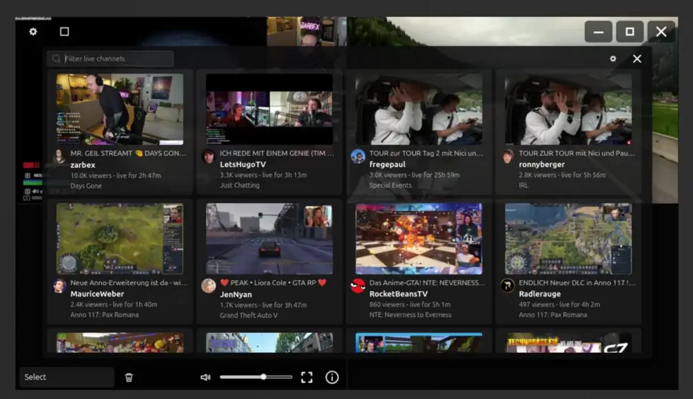

# Twitch Player

A lightweight desktop app for watching Twitch streams with chat, fullscreen
controls, and an optional 2x2 stream grid.

<p align="center">
  
  <br>
  
</p>

Use it for focused Twitch viewing on Linux, whether you want one channel with
chat beside it or several channels visible at once.

## Streams

Channels are loaded from the user settings file:

```text
~/.config/twitch-player/settings.json
```

The first start is intentionally empty. Add channels through the Settings button
in the top-left overlay.

Open Settings > Channels and use "Connect Twitch" to authorize the app. The app
uses Twitch's device-code flow and stores the resulting user token in the
settings file. A client secret is not used by this desktop app.

## Dependencies

On Ubuntu/Debian:

```bash
sudo apt install build-essential meson ninja-build pkg-config libgtk-4-dev libmpv-dev libepoxy-dev mpv yt-dlp
```

Check the local machine:

```bash
./scripts/check-deps.sh
```

## Build

```bash
meson setup build
meson compile -C build
```

Or use the Makefile wrapper:

```bash
make setup
make build
```

## Run

```bash
./build/twitch-player
```

Start with a channel or URL:

```bash
./build/twitch-player papaplatte
./build/twitch-player https://www.twitch.tv/montanablack88
```

Switch between the normal player and the 2x2 grid from the overlay controls.
Start directly in grid mode with up to four channels:

```bash
./build/twitch-player --grid papaplatte rumathra
./build/twitch-player --grid papaplatte rumathra montanablack88 another_channel
```
